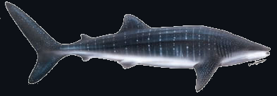

# gaps-online-software

This is branch LELEWAA-0.10. [Lelewaa is a whale shark](https://dlnr.hawaii.gov/dar/sharks-and-rays/).

>[!TIP] 
>Whale sharks are the largest fish on the planet, and despite their size they are not aggressive towards humans. Whale sharks can be spotted in the Hawaiian waters, however, sightings are rare so if you see enjoy your encounter and please be respectful. 

>[!NOTE]
>Apparently the Hawai'ian name Lelewa'a stems from the tale that the whale sharks like to approach and lean on canoe outriggers. 

In contrast to what we claimed in the last pre-release branch, HAHALUA-0.9, this branch is NOT the flight version. Creating another pre-release version had been become necessary, because a breaking change in the way we communicate with the MTB has 
been introduce, see also [MTB fw v3.0.0](https://gitlab.com/ucla-gaps-tof/firmware/-/tree/v3.0.0) . This affects the size of the MasterTriggerEvent. The purpose of this branch is to align the MasterTriggerEvent closer to the actual representation 
on the MTB, which will boost performance and reduce data size, while increasing clarity and readibility of the code.
**All previous data will be readable with this code, however, data taken with this version (or a later version of the code will not be able to be read by earlier versions of this code (or there is no guarantee that it works))** 

## API docs 

The API docs for Rust as well as for the C++ API are hosted on github-pages. Documentation
for the python API will follow soon.

[API-docs](https://gaps-collab.github.io/gaps-online-software/)

## prerequisites

* rust toolchain - to compile `liftof` flight software suite as well as
  `tof-dataclasses` which are the backbone of `liftof`
* `cmake` is used as a build system
* `pybind11` is used to build the pybindings for the C++ API. It also 
   requires a minimum of `gcc-13` and python `3.10`
*  a number of C++ libraries are pulled from github during installation.

### software repository

The code is organized in a (private) github repository at 
* [github](https://github.com/GAPS-Collab/gaps-online-software)

## installation

### Clone the repository wit submodules

We are using git submodules to pull in some of the dependencies.
To automatically check them out when clone te repository, use
`git clone --recurse-submodules`

### Branches and how to get updates

The branches/releases are named after fish in Hawaii. A fish 
identification card can be found [here](https://www.honolulu.gov/rep/site/dpr/dpr_docs/hbep_fish_id_card.pdf).
You can switch branches with `git checkout <branch>`. To get updates, use `git pull`

Usually, each branch has a specific purpose, everything with version numbers < 1.0.0 or 
named `develop` or `<name>_dev` will be unstable.
The branches following the naming scheme "FISHNAME-X.X" are dedicated to specific tasks, 
e.g. the NTS campaign. Please see the dedicated README for this branch.

We are following a git-flow model, which is e.g. described [here](https://www.gitkraken.com/learn/git/git-flow). This means that `main` should point to the latest release, however, it has to be considered that until
we are at version < 1.0.0, there are no "official" releases. Instead, the main branch will point to the 
most stable and useful version at the time.

### Build system

The installation uses `cmake`. Create a build directory and execute
`cmake <gaps-online-software source directory> --install-prefix <install_dir>`

After that, you can have a look at the `cmake` cache with 
`ccmake .` in your build directory. If everything seems ok, execute:

`make`
`make doc`
`make install`

After that, the `build` directory can be discarded, but might be kept for 
a quicker build when there are updates. Important is the `<install_dir>`.

In `<install_dir>` there is a `setup-env.sh` script, this needs to be sourced 
in order to set the necessary variables for `PYTHONPATH`, `PATH` and `LD_LIBRARY_PATH`.
Do so with 
`source setup-env.sh`
It will greet you with a banner.

After that, you can either write your own C++ code, linking to the gaps-online-software
C++ API, or use the include pybindings (if `pybind11` was available at compile time)

To use the pybindings, simply fire up an (i)python shell and type:
`import gaps_tof as gt`

Then the bindings should be ready. Example code on how to use them can be found in 
`<install_dir>/examples/`

[More detailed installation instructions can be found in INSTALL.MD](INSTALL.md)

## software components

The software includes (<src> is the original source directory of `gaps-online-software`:

- dataclasses for the time-of-flight system (`<src>/tof/dataclasses`) available for rust 
  and C++/PYTHON
- software for the tof flight computer as well as the readoutboards in 
  `<src>/tof/liftof` written in rust. This has several components:
  - `liftof-rb` - code to be run on the readoutboards. This has to be cross-compiled for 
    the ARM32 architechture. This can be done with the [`cross`](https://github.com/cross-rs/cross) project.  
    Helper scripts for that are provided, it does need a docker installation.
  - `liftof-cc` - code to be run on the tof computer. This is Command&Control code, which collects the data 
    from the MTB and the readoutboards, analyses and packages them and answers to commands from the flight 
    computer
  - `liftof-lib` - common functionality for all `liftof` code, factored out
  - `liftof-analysis` - recently started project to perform common analysis tasks directly with the rust API
  - `liftof-tui` - an interactive tui ("terminal user interface") which allows a live view of waveforms and 
                   other tof related quantities in the terminal.
- A database system : `<src>/gaps_db` written in Python/django it uses a `sqlite` backend and is basically the 
                      translation of Sydney's paddle spreadsheet. The db can be used by `liftof` as well 
                      as python analysis code.
- A live eventviewer : `<src>/event-viewer` This currently only shows the tracker in a 2d projection.

## A note about testing

`cargo` provides unit and integration tests. Without going into further detail here,
please note that some care is needed that all tests are run when using `cargo test`. 
In general, there is 

* `cargo test --features=random` to run the unit tests
* `cargo test --features=random --test=test` to run the integration tests

The command `cargo test --features=random -- list` will list all tests. Further usefule
is the addition of the `--no-capture` flag, e.g. `cargo test --features=random -- --no-captuer` in case the output of the tests shall be printed as well.

## getting help

Please see the README.md in the individual subfolders. 

## maintainer

* A. Stoessl <stoessl@hawaii.edu>

* P. Lazzaroni <paolo.lazzaroni@unibg.it>
