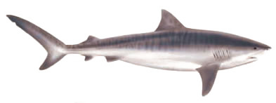

# gaps-online-software

This is branch NIUHI-0.8. [Niuhi is a tiger shark](https://dlnr.hawaii.gov/sharks/sharks/tiger-shark/).

Tiger sharks roam the waters of the Hawaiian islands. 
This branch is not necessarily connected to a measurement 
campaign, but to a series of tests at UCLA, eg to investigate
[issue 6](https://github.com/GAPS-Collab/gaps-online-software/issues/6). 
It is related to the previous release branch, OMILU-0.7 in the soirit of 
carrying on the development, however, since we now entered a phase of 
datataking, the OMILU branch won't be updated any more with new features
and it is easier to keep 2 related branches in paralell.

## prerequisites

`cmake` and `pybind11` are needed in case pybindings should be compiled.
The tof flight software suite (`liftof`) requires a rust toolchain, since 
it is written in rust.

## branches and how to get updates

The main branch is set to the latest release, a release is a frozen 
version at the end of a development cycle. To get the newest code, 
one has to switch to the branch with the highest version number 
available, e.g. KIHIKIHI-0.6. Releases are typically related to specific
test campaigns, e.g. NTS. The develop branch is intended for forward and 
far-future development and might contain experimental features. 
The branches/releases are named after fish in Hawaii. A fish 
identification card can be found [here](https://www.honolulu.gov/rep/site/dpr/dpr_docs/hbep_fish_id_card.pdf).
You can switch branches with `git checkout <branch>`. To get updates, use `git pull`

### software repositories

There are two repositories, which are both (hopefully) kept in sync, so they are interchangeable

* [gitlab (UH)](https://uhhepvcs.phys.hawaii.edu/Achim/gaps-online-software)
* [github](https://github.com/GAPS-Collab/gaps-online-software)

## installation

### Clone the repository wit submodules

We are using git submodules to pull in some of the dependencies.
To automatically check them out when clone te repository, use
`git clone --recurse-submodules`

The installation uses `cmake`. Create a build directory and execute
`cmake <gaps-online-software source directory> --prefix <install_dir>`

After that, you can have a look at the `cmake` cache with 
`ccmake .` in your build directory. If everything seems ok, execute:

`make`
`make doc`
`make install`

After that, the `build` directory can be discarded, but might be kept for 
a quicker build when there are updates. Important is the `<install_dir>`.

In `<install_dir>` there is a `setup-env.sh` script, this needs to be sourced 
in order to set the necessary variables for `PYTHONPATH`, `PATH` and `LD_LIBRARY_PATH`.
Do so with 
`source setup-env.sh`
It will greet you with a banner.

After that, you can either write your own C++ code, linking to the gaps-online-software
C++ API, or use the include pybindings (if `pybind11` was available at compile time)

To use the pybindings, simply fire up an (i)python shell and type:
`import gaps_tof as gt`

Then the bindings should be ready. Example code on how to use them can be found in 
`<install_dir>/examples/`

[More detailed installation instructions can be found in INSTALL.MD](INSTALL.md)

## software components

The software includes (<src> is the original source directory of `gaps-online-software`:

- dataclasses for the time-of-flight system (`<src>/tof/dataclasses`) available for rust 
  and C++/PYTHON
- software for the tof flight computer as well as the readoutboards in 
  `<src>/tof/liftof` written in rust. This has several components:
  - `liftof-rb` - code to be run on the readoutboards. This has to be cross-compiled for 
    the ARM32 architechture. This can be done with the [`cross`](https://github.com/cross-rs/cross) project.  
    Helper scripts for that are provided, it does need a docker installation.
  - `liftof-cc` - code to be run on the tof computer. This is Command&Control code, which collects the data 
    from the MTB and the readoutboards, analyses and packages them and answers to commands from the flight 
    computer
  - `liftof-lib` - common functionality for all `liftof` code, factored out
  - `liftof-analysis` - recently started project to perform common analysis tasks directly with the rust API
  - `liftof-tui` - an interactive tui ("terminal user interface") which allows a live view of waveforms and 
                   other tof related quantities in the terminal.
- A database system : `<src>/gaps_db` written in Python/django it uses a `sqlite` backend and is basically the 
                      translation of Sydney's paddle spreadsheet. The db can be used by `liftof` as well 
                      as python analysis code.
- A live eventviewer : `<src>/event-viewer` This currently only shows the tracker in a 2d projection.

## A note about testing

`cargo` provides unit and integration tests. Without going into further detail here,
please note that some care is needed that all tests are run when using `cargo test`. 
In general, there is 

* `cargo test --features=random` to run the unit tests
* `cargo test --features=random --test=test` to run the integration tests

The command `cargo test --features=random -- list` will list all tests. Further usefule
is the addition of the `--no-capture` flag, e.g. `cargo test --features=random -- --no-captuer` in case the output of the tests shall be printed as well.

## getting help

Please see the README.md in the individual subfolders. 

## maintainer

A. Stoessl <stoessl@hawaii.edu>

