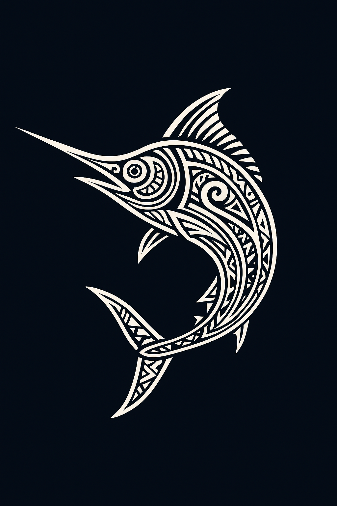

# gaps-online-software

This is version AULEPE-0.12. [Aulepe are sailfish!](https://en.wikipedia.org/wiki/Sailfish).

>[!NOTE] 
>The fastest non-airborne species is actually not the Cheetah! Marine life can be even faster. While the sailfish seems to be a little less fast then the [fastest non-airborne animal on the planet (Black Marlin with speeds up to 80MpH)](https://en.wikipedia.org/wiki/Fastest_animals). Thus the Black Marlin is faster than a Cheetah.
>Sailfish have been observed to swim up to 68 MpH, and while that's a little less fast than their world-record cousin, their displays when they leap out of the water at these speed are quite astonishing. 
>Marlin can be found around the Hawaiian islands and are actually quite tasty!

## CHANGELOG/Migration guide  
[Since v0.12 we are keeping a global CHANELOG.MD](CHANGELOG.md)

* Antarctic RBWaveform data from telemetry might not be able to be read be read with this version, use v0.11 instead 
## API docs 

The documentation supports different release versions of the code and is hosted on github-pages.

[API-docs](https://gaps-collab.github.io/gaps-online-software/)

## installation

<<<<<<< HEAD
* rust toolchain - to compile `liftof` flight software suite as well as
  `tof-dataclasses` and `telemetry-dataclasses` 
* `cmake` is used as a build system
*  a number of C++ libraries are pulled from github during installation.
* The C++ API uses the C++20 standard and thus wants gcc-13 or later.
* We highly recommend the excellent [rye](https://rye.astral.sh/) to deal with 
  python installations, however, the developer has announced that rye is succeeded by 
  uv, so in the future we will migrate  
=======
### Installation of the python library 

The python code is called `gondola` and hosted on [pypi](https://pypi.org/project/gondola/) and can 
be installed with `uv/rye/pip` and friends.
>>>>>>> PAKII-0.11

### software repository

The code is organized in a public github repository at 
* [github](https://github.com/GAPS-Collab/gaps-online-software)

### Clone the repository wit submodules

We are using git submodules to pull in some of the dependencies.
To automatically check them out when clone te repository, use
`git clone --recurse-submodules`

## prerequisites

* rust toolchain - to compile `liftof` flight software suite as well as the 
  core library `gondola-core` with the pybindings. Rust edtion 2024 is 
  required
* `cmake` is used as a build system for the C++ part.
* The C++ API uses the C++20 standard and thus wants gcc-13 or later.
* Doxygen to build the C++ documentation locally.

### Branches and how to get updates

The branches/releases are named after fish in Hawaii. A fish 
identification card can be found [here](https://www.honolulu.gov/rep/site/dpr/dpr_docs/hbep_fish_id_card.pdf).
You can switch branches with `git checkout <branch>`. To get updates, use `git pull`

Usually, each branch has a specific purpose, everything with version numbers < 1.0.0 will be unstable, meaning there is no guarantee for code to work even after a pull.
The branches following the naming scheme "FISHNAME-X.X" are dedicated to specific tasks, 
e.g. the NTS campaign. Please see the dedicated README for the specific branch.

<<<<<<< HEAD
We are following a git-flow model, which is e.g. described [here](https://www.gitkraken.com/learn/git/git-flow). This means that `main` should point to the latest release, however, it has to be considered that until
we are at version < 1.0.0, there are no "official" releases. Instead, the main branch will point to the 
most stable and useful version at the time for the sake of convenience.
=======
The `main` branch will be the latest development branch or that what is considered useful for the specific
purpose at the time and the last release branch will follow the 
main branch closely.  

Pre-releases will happen on an irregular timeline and are associated with specific git tags.
>>>>>>> PAKII-0.11

### Build system (C++)

The installation uses `cmake`. Create a build directory and execute
`cmake <gaps-online-software source directory> --install-prefix <install_dir>`

After that, you can have a look at the `cmake` cache with 
`ccmake .` in your build directory. If everything seems ok, execute:

`make`
`make doc`
`make install`

After that, the `build` directory can be discarded, but might be kept for 
a quicker build when there are updates. Important is the `<install_dir>`.

In `<install_dir>` there is a `setup-env.sh` script, this needs to be sourced 
in order to set the necessary variables for `PYTHONPATH`, `PATH` and `LD_LIBRARY_PATH`.
Do so with 
`source setup-env.sh`
It will greet you with a banner.

After that, you can either write your own C++ code, linking to the gaps-online-software
C++ API, or use the included pybindings

Example code on how to use them can be found in 
`<install_dir>/examples/`

[More detailed installation instructions can be found in INSTALL.MD](INSTALL.md)

## software components

The software includes (<src> is the original source directory of `gaps-online-software`:

- dataclasses for the time-of-flight system (`<src>/tof/dataclasses`) available for rust 
  and C++/PYTHON
- dataclasses to read the telemetry stream (`<src>/telemetry/dataclasses`) available for rust/Python
- software for the tof flight computer as well as the readoutboards in 
  `<src>/tof/liftof` written in rust. This has several components:
  - `liftof-rb` - code to be run on the readoutboards. This has to be cross-compiled for 
    the ARM32 architechture. This can be done with the [`cross`](https://github.com/cross-rs/cross) project.  
    Helper scripts for that are provided, it does need a docker installation.
  - `liftof-cc` - code to be run on the tof computer. This is Command&Control code, which collects the data 
    from the MTB and the readoutboards, analyses and packages them and answers to commands from the flight 
    computer
  - `liftof-lib` - common functionality for all `liftof` code, factored out
  - `liftof-tui` - an interactive tui ("terminal user interface") which allows a live view of waveforms and 
                   other tof related quantities in the terminal.
- A database system : `<src>/gaps_db` written in Python/django it uses a `sqlite` backend and is basically the 
                      translation of Sydney's paddle spreadsheet. The db can be used by `liftof` as well 
                      as python analysis code.
- A live eventviewer : `<src>/event-viewer` This currently only shows the tracker in a 2d projection.

## A note about testing

`cargo` provides unit and integration tests. Without going into further detail here,
please note that some care is needed that all tests are run when using `cargo test`. 
In general, there is 

* `cargo test --features=random` to run the unit tests
* `cargo test --features=random --test=test` to run the integration tests

The command `cargo test --features=random -- list` will list all tests. Further usefule
is the addition of the `--no-capture` flag, e.g. `cargo test --features=random -- --no-captuer` in case the output of the tests shall be printed as well.

## getting help

Please see the README.md in the individual subfolders. 

## maintainer

* A. Stoessl <stoessl@hawaii.edu>

* G. Tytus <gtytus@hawaii.it>
