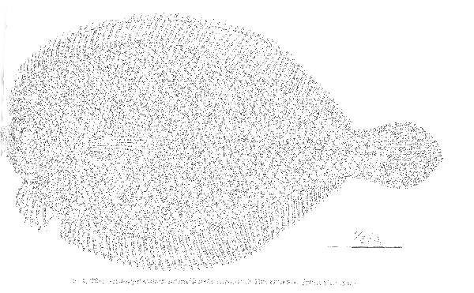

# gaps-online-software

This is branch PAKII-0.11. [Pakii is a flounder endemic to Hawaii](https://www.inaturalist.org/guide_taxa/2297560).

>[!TIP] 
>The word "Pakii" can describe many species of flounders, the ones here a species of small-lefteye flounders (_Engyprosopon hawaiiensis_)

>[!NOTE]
>The Hawai'ian word means "flat, fallen flat, spread out flat". Flounders typically stay close to the ground. Do I have to say more? 

## General overview, what's new?

This branch will improve on the previous code with the information which we learned from the 2024/2025 Antarctic ground cooling campaign. To work with the data from this campaign, please use the LELEWAA branch instead.
The main purpose of this development efforts are:

* consolidation/refactoring of the code. The different aspects of the project are scattered over many subprojects, but some functionality is common, especially for data i/o. 
* stronger integration of the rust-pybidings. These are currently kept mostly seperate. "Mostly" is the problem here.
* provide easy-to-use applications for specific purposes: E.g. live data checkout, detector occupancy evolution over time.  
* finally an event viewer
* changes to the build system to be more rye-friendly for the python part and provide a better system wfor the setup of the environment (rye compatible .env) files
* **A reduction of the data size** - Especially housekeeping data has many `u64` fields, for whcih we can live with `u32` instead.
* **Unification of TofEvent and TofEventSummary, as well as the deprecation of the MasterTriggerEvent**- all relevant information is kept in the TofEventSummary already, except the `RBEvents`. The TofEvent contains many fields, which are actually never used and currently are all zeroed out.   
* improved installation for Apple systems
* compatibility with python 3.13
* the byteorder of `u32` in the RB fw is mangled. At this point, it is not clear if this will change.  

**THIS BRANCH WILL INTRODUCE BREAKING, POSSIBLY NON-BACKWARDS COMPATIBLE CHANGES TO THE DATA STRUCTURES!** 

## Deprecation/Removes

* `RobinReader` will be removed from this branch
* The removal of the C++/pybind11 bindings is under discussion. They might be kept as a (very) optional dependency for the sole purpose of C++/Rust API interoperability testing 

## API docs 

The API docs for Rust/C++/Python are hosted on github-pages. However, the current documentation is
always referring to the the main branch, so it might or might not be accurate.

[API-docs](https://gaps-collab.github.io/gaps-online-software/)

## prerequisites

* rust toolchain - to compile `liftof` flight software suite as well as
  `tof-dataclasses` and `telemetry-dataclasses` 
* `cmake` is used as a build system
*  a number of C++ libraries are pulled from github during installation.
* The C++ API uses the C++20 standard and thus wants gcc-13 or later.

### software repository

The code is organized in a github repository at 
* [github](https://github.com/GAPS-Collab/gaps-online-software)

## installation

### Clone the repository wit submodules

We are using git submodules to pull in some of the dependencies.
To automatically check them out when clone te repository, use
`git clone --recurse-submodules`

### Branches and how to get updates

The branches/releases are named after fish in Hawaii. A fish 
identification card can be found [here](https://www.honolulu.gov/rep/site/dpr/dpr_docs/hbep_fish_id_card.pdf).
You can switch branches with `git checkout <branch>`. To get updates, use `git pull`

Usually, each branch has a specific purpose, everything with version numbers < 1.0.0 or 
named `develop`  will be unstable.
The branches following the naming scheme "FISHNAME-X.X" are dedicated to specific tasks, 
e.g. the NTS campaign. Please see the dedicated README for the specific branch.

The `main` branch will be the latest development branch and the last release branch will follow the 
main branch closely.  

Pre-releases will happen on an irregular timeline and are associated with specific git tags.

### Build system

The installation uses `cmake`. Create a build directory and execute
`cmake <gaps-online-software source directory> --install-prefix <install_dir>`

After that, you can have a look at the `cmake` cache with 
`ccmake .` in your build directory. If everything seems ok, execute:

`make`
`make doc`
`make install`

After that, the `build` directory can be discarded, but might be kept for 
a quicker build when there are updates. Important is the `<install_dir>`.

In `<install_dir>` there is a `setup-env.sh` script, this needs to be sourced 
in order to set the necessary variables for `PYTHONPATH`, `PATH` and `LD_LIBRARY_PATH`.
Do so with 
`source setup-env.sh`
It will greet you with a banner.

After that, you can either write your own C++ code, linking to the gaps-online-software
C++ API, or use the include pybindings (if `pybind11` was available at compile time)

To use the pybindings, simply fire up an (i)python shell and type:
`import gaps_tof as gt`

Then the bindings should be ready. Example code on how to use them can be found in 
`<install_dir>/examples/`

[More detailed installation instructions can be found in INSTALL.MD](INSTALL.md)

## software components

The software includes (<src> is the original source directory of `gaps-online-software`:

- dataclasses for the time-of-flight system (`<src>/tof/dataclasses`) available for rust 
  and C++/PYTHON
- dataclasses to read the telemetry stream (`<src>/telemetry/dataclasses`) available for rust/Python
- software for the tof flight computer as well as the readoutboards in 
  `<src>/tof/liftof` written in rust. This has several components:
  - `liftof-rb` - code to be run on the readoutboards. This has to be cross-compiled for 
    the ARM32 architechture. This can be done with the [`cross`](https://github.com/cross-rs/cross) project.  
    Helper scripts for that are provided, it does need a docker installation.
  - `liftof-cc` - code to be run on the tof computer. This is Command&Control code, which collects the data 
    from the MTB and the readoutboards, analyses and packages them and answers to commands from the flight 
    computer
  - `liftof-lib` - common functionality for all `liftof` code, factored out
  - `liftof-tui` - an interactive tui ("terminal user interface") which allows a live view of waveforms and 
                   other tof related quantities in the terminal.
- A database system : `<src>/gaps_db` written in Python/django it uses a `sqlite` backend and is basically the 
                      translation of Sydney's paddle spreadsheet. The db can be used by `liftof` as well 
                      as python analysis code.
- A live eventviewer : `<src>/event-viewer` This currently only shows the tracker in a 2d projection.

## A note about testing

`cargo` provides unit and integration tests. Without going into further detail here,
please note that some care is needed that all tests are run when using `cargo test`. 
In general, there is 

* `cargo test --features=random` to run the unit tests
* `cargo test --features=random --test=test` to run the integration tests

The command `cargo test --features=random -- list` will list all tests. Further usefule
is the addition of the `--no-capture` flag, e.g. `cargo test --features=random -- --no-captuer` in case the output of the tests shall be printed as well.

## getting help

Please see the README.md in the individual subfolders. 

## maintainer

* A. Stoessl <stoessl@hawaii.edu>

* G. Tytus <gtytus@hawaii.it>
