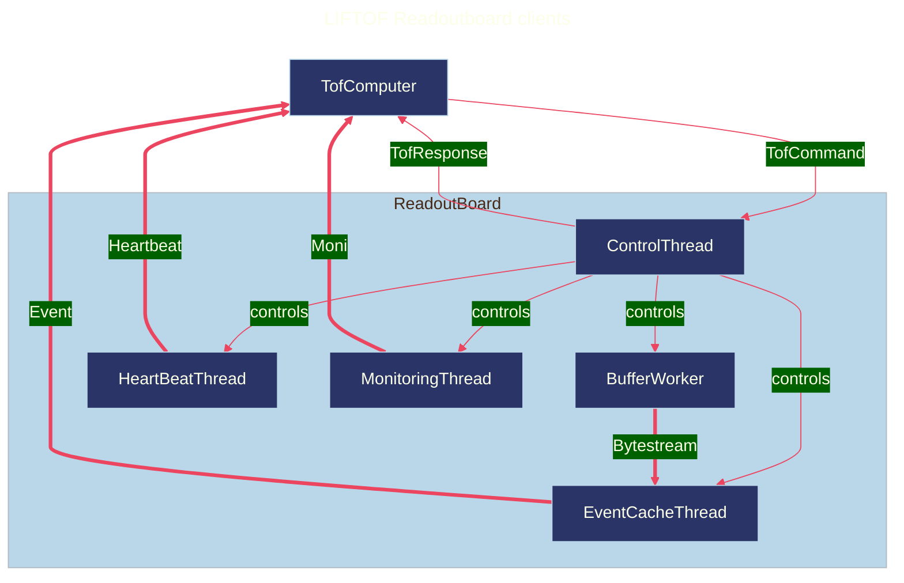

# readoutboard software

## client which runs on the readoutboards

* Access the dedicated memory /dev/uio0 /dev/uio1 /dev/uio2
  to control DRS4 and readout blobs

* Send blob information per request over zmq socket

### Connectivity

### Design philosopy

### Threaded model

### Helpful resources

https://linux-kernel-labs.github.io/refs/heads/master/labs/memory_mapping.html
